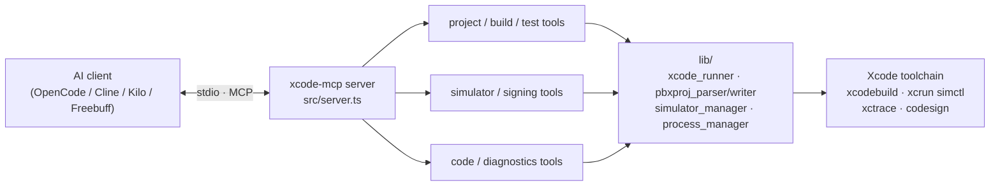

# ⚒️ xcode-mcp


> **Drive Xcode with AI.** Build, test, sign, simulate, profile and debug iOS/macOS projects — without touching Xcode.

`xcode-mcp` is a [Model Context Protocol](https://modelcontextprotocol.io) server that bridges AI coding assistants with Xcode. **46 tools, 5 resources, 4 prompts** — full project control over `stdio`, hardened with input validation, atomic project-file writes, and a 25-test QA suite.

---

## ✨ Highlights

| | |
|---|---|
| 🧰 **46 tools** | Projects, builds, simulators, tests, code, signing, diagnostics |
| 🤖 **4 AI clients** | OpenCode · Cline · Kilo Code · Freebuff (one-command setup) |
| 🖥️ **Daemon control** | `serverctl.py` — start / stop / restart / status / logs / run |
| 🛡️ **Hardened** | Path-traversal guard, arg validation, atomic `project.pbxproj` writes with backups |
| ✅ **Tested** | `npm test` — 25 tests incl. a realistic commented-`pbxproj` fixture |
| 📦 **One installer** | Single `install.py` for macOS, Windows & Linux (stdlib only) |

---

## 📑 Contents

- [Quick install](#-quick-install)
- [AI client setup](#-ai-client-setup)
- [Server control](#-server-control)
- [Tools](#-tools)
- [Resources & prompts](#-resources--prompts)
- [Environment variables](#-environment-variables)
- [Project config file](#-project-config-file)
- [Architecture](#-architecture)
- [Security](#-security)
- [Development & QA](#-development--qa)
- [Contributing](#-contributing)
- [License](#-license)

---

## 🚀 Quick install

**Requirements:** macOS with Xcode 14+ (to *run* the tools), Node 18+, Python 3.8+ (installer only).

```bash
git clone https://github.com/Raunaksplanet/xcode-mcp-server
cd xcode-mcp-server
python3 install.py
```

That's it — the installer checks prerequisites, installs dependencies, builds TypeScript, asks for your `.xcodeproj`/`.xcworkspace` and target clients, registers the server, and smoke-tests the build.

```bash
# Non-interactive (CI friendly)
python3 install.py --project-path ~/Projects/MyApp.xcodeproj --clients all --yes

# Preview everything without touching disk
python3 install.py --dry-run

# Remote one-liner
curl -sL https://raw.githubusercontent.com/Raunaksplanet/xcode-mcp-server/main/install.py \
  | python3 - --project-path ~/Projects/MyApp.xcodeproj --clients all --yes
```

> `python3 install.py --help` shows all flags (`--no-deps`, `--no-build`, `--strict`, `--freebuff-global`, …). Every config edit is backed up (`*.bak.<timestamp>`) and corrupt JSON is recovered, never deleted.

---

## 🤖 AI client setup

One script registers the `xcode` server everywhere — or pick clients à la carte:

```bash
node scripts/setup-clients.mjs --client all --project-path ~/Projects/MyApp.xcodeproj --scheme MyApp

npm run setup:opencode   # OpenCode
npm run setup:cline      # Cline
npm run setup:kilo       # Kilo Code
npm run setup:freebuff   # Freebuff / Codebuff CLI
```

| Client | Config file | Format |
|---|---|---|
| **OpenCode** | `~/.config/opencode/opencode.json` | `mcp.xcode` (+ v2 `mcp.servers` mirror) |
| **Cline** | `~/.cline/data/settings/cline_mcp_settings.json` | `mcpServers.xcode` |
| **Kilo Code** | `~/.config/kilo/kilo.jsonc` | `mcp.xcode` |
| **Freebuff** | `<project>/.agents/mcp.json` | `mcpServers.xcode` |

Manual minimal entry (OpenCode flavor):

```jsonc
{
  "mcp": {
    "xcode": {
      "type": "local",
      "command": ["node", "/absolute/path/to/xcode-mcp/dist/index.js"],
      "environment": {
        "XCODE_PROJECT_PATH": "/path/to/YourApp.xcodeproj",
        "XCODE_DEFAULT_SCHEME": "YourApp"
      },
      "enabled": true
    }
  }
}
```

🔁 **Restart your AI client** after setup so it picks up the new MCP server.

---

## 🎛️ Server control

`serverctl.py` runs the server as a background daemon (macOS, Windows, Linux):

```bash
python3 serverctl.py start --project-path ~/Projects/MyApp.xcodeproj --scheme MyApp
python3 serverctl.py status                 # exit 0 = running, 1 = stopped
python3 serverctl.py status --json          # machine-readable
python3 serverctl.py logs --lines 50        # tail the log
python3 serverctl.py logs --follow          # tail -f (Ctrl+C to stop)
python3 serverctl.py restart
python3 serverctl.py stop                   # graceful SIGTERM → SIGKILL fallback
python3 serverctl.py run --project-path …   # foreground, for debugging
```

State lives in `~/.xcode-mcp/` (`run/xcode-mcp.pid`, `logs/xcode-mcp.log`) — override with `--base-dir` or `$XCODE_MCP_HOME`. `start` refuses duplicates (PID identity-verified), watches for early crashes and prints the log tail on failure; stale pidfiles are detected and cleaned.

---

## 🧰 Tools

> Full signatures in [`TOOLS_REFERENCE.md`](TOOLS_REFERENCE.md).

<details>
<summary><b>📁 Project management</b> (10)</summary>

`xcode_open_project` · `xcode_get_project_info` · `xcode_list_targets` · `xcode_list_schemes` · `xcode_list_files` · `xcode_add_file` · `xcode_remove_file` · `xcode_get_build_settings` · `xcode_set_build_setting` · `xcode_resolve_packages`
</details>

<details>
<summary><b>🔨 Build</b> (6)</summary>

`xcode_build` · `xcode_build_for_testing` · `xcode_archive` · `xcode_clean` · `xcode_get_build_errors` · `xcode_get_analyzer_results`
</details>

<details>
<summary><b>📱 Simulator control</b> (13)</summary>

`xcode_list_simulators` · `xcode_boot_simulator` · `xcode_shutdown_simulator` · `xcode_install_app` · `xcode_launch_app` · `xcode_terminate_app` · `xcode_get_simulator_logs` · `xcode_screenshot_simulator` · `xcode_record_simulator` · `xcode_open_url_simulator` · `xcode_set_simulator_location` · `xcode_push_notification_simulator` · `xcode_reset_simulator`
</details>

<details>
<summary><b>🧪 Testing</b> (4)</summary>

`xcode_run_tests` · `xcode_run_single_test` · `xcode_get_test_results` · `xcode_get_code_coverage`
</details>

<details>
<summary><b>💻 Code management</b> (6)</summary>

`xcode_read_file` · `xcode_write_file` · `xcode_edit_file` · `xcode_get_swift_symbols` · `xcode_format_file` · `xcode_search_in_project`
</details>

<details>
<summary><b>🔏 Code signing</b> (4)</summary>

`xcode_list_certificates` · `xcode_list_provisioning_profiles` · `xcode_set_signing` · `xcode_validate_signing`
</details>

<details>
<summary><b>🩺 Diagnostics</b> (3)</summary>

`xcode_get_warnings` · `xcode_profile_app` · `xcode_add_spm_package`
</details>

---

## 📚 Resources & prompts

**Resources** — `xcode://project/structure` · `xcode://project/settings` · `xcode://build/latest_log` · `xcode://build/errors` · `xcode://simulators/list`

**Prompts** — `fix_build_error` · `create_swift_feature` · `write_xctest` · `review_swift_code`

---

## 🔧 Environment variables

| Variable | Required | Description |
|---|---|---|
| `XCODE_PROJECT_PATH` | ✅ | Path to `.xcodeproj` or `.xcworkspace` |
| `XCODE_DEFAULT_SCHEME` | – | Default scheme for build/test |
| `XCODE_DEFAULT_SIMULATOR` | – | Default simulator UDID or name |
| `XCODE_DERIVED_DATA_PATH` | – | Custom DerivedData path |
| `XCODE_MCP_LOG_LEVEL` | – | `debug`/`info`/`warn`/`error` (default `info`) |
| `XCODE_MCP_BUILD_TIMEOUT` | – | Build timeout, seconds (default `300`) |
| `XCODE_MCP_TEST_TIMEOUT` | – | Test timeout, seconds (default `600`) |
| `XCODE_MCP_HOME` | – | State dir for `serverctl.py` (default `~/.xcode-mcp`) |

---

## ⚙️ Project config file

Drop `.xcode-mcp.json` next to your `.xcodeproj`:

```json
{
  "default_scheme": "MyApp",
  "default_simulator": "iPhone 16 Pro",
  "excluded_paths": ["Pods", "vendor"],
  "build_pre_hooks": ["echo 'Starting build...'"],
  "build_post_hooks": ["echo 'Build complete!'"],
  "custom_destinations": ["platform=iOS Simulator,name=iPhone 16,OS=latest"]
}
```

---

## 🏗️ Architecture



```
xcode-mcp/
├── install.py            # cross-platform installer (macOS/Windows/Linux)
├── serverctl.py          # daemon control: start/stop/restart/status/logs/run
├── scripts/
│   └── setup-clients.mjs # per-client MCP registration
├── src/
│   ├── index.ts          # entry point
│   ├── server.ts         # MCP server setup
│   ├── tools/            # 46 tool implementations
│   ├── lib/              # xcode_runner, pbxproj_parser/writer,
│   │                     # simulator_manager, process_manager,
│   │                     # validation, build_log, config, logger …
│   ├── types/            # pbxproj / xcodebuild / simulator types
│   ├── resources/        # MCP resource providers
│   └── prompts/          # MCP prompt templates
├── tests/
│   └── qa.test.ts        # 25 QA tests (npm test)
└── TOOLS_REFERENCE.md    # full tool signatures & error codes
```

---

## 🛡️ Security

- All file paths validated against the project root (sibling-prefix escapes blocked)
- Every tool argument type/length-checked; validation failures return structured errors
- No shell execution anywhere — all subprocess calls use argv arrays (`execFile`, no `shell:true`)
- `project.pbxproj` writes are atomic (tmp + rename) with timestamped backups
- Concurrent `xcodebuild` calls serialized (max 2) to protect DerivedData
- Timeouts on every external process; output buffers capped
- Wipes scoped to the project's own DerivedData — never the global tree
- Certificates/keys never logged; `npm audit --omit=dev` clean

---

## 🧪 Development & QA

```bash
npm install
npm run typecheck   # strict tsc
npm test            # 25 tests: parser fixtures, writer round-trips,
                    # build-output parsing, validation helpers
npm run build       # tsup bundle → dist/
npm start           # run the server (needs XCODE_PROJECT_PATH)
```

---

## 🤝 Contributing

Issues and PRs welcome at [Raunaksplanet/xcode-mcp-server](https://github.com/Raunaksplanet/xcode-mcp-server). Please run `npm run typecheck && npm test` before submitting.

## 📄 License

MIT — see [LICENSE](LICENSE).
